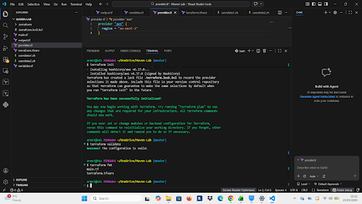
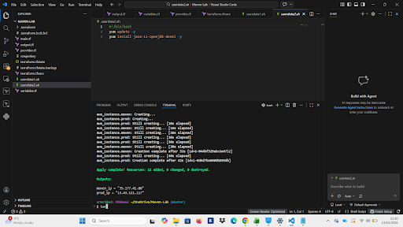
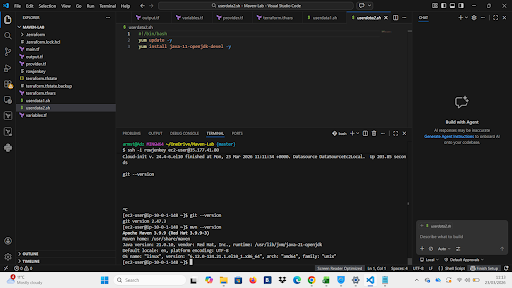
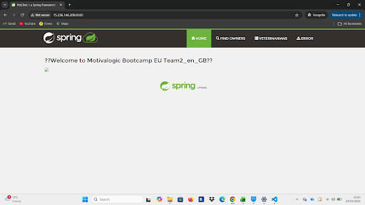

 Terraform Jenkins Maven Lab

 Overview

This project demonstrates provisioning AWS infrastructure using Terraform and deploying a working Spring Boot application using Maven.

It simulates a real DevOps workflow where infrastructure is created programmatically and an application is deployed and made accessible via a public endpoint.

The setup includes:
- Automated EC2 provisioning using Terraform
- User data scripts for environment configuration
- Java and Maven installation
- Deployment of a Spring Boot application
- Public access to the running application

---

Architecture

The infrastructure consists of:

- AWS EC2 instances provisioned via Terraform
- Security Groups allowing HTTP (80) and application access (8080)
- User data scripts to install dependencies and run the application
- Spring Boot application built and executed with Maven

---

Project Structure

```bash
.
├── main.tf
├── provider.tf
├── variables.tf
├── terraform.tfvars.example
├── output.tf
├── userdata1.sh
├── userdata2.sh
├── screenshots/
└── README.md
Prerequisites
Terraform installed
AWS account
AWS CLI configured (aws configure)
SSH key pair (or Terraform-managed)
Setup & Deployment
git clone https://github.com/adz3k/terraform-jenkins-maven-lab.git
cd terraform-jenkins-maven-lab

cp terraform.tfvars.example terraform.tfvars

Edit your variables, then run:

terraform init
terraform plan
terraform apply
Screenshots (Proof of Deployment)

These screenshots demonstrate that the infrastructure was successfully provisioned and the application is running.

 Screenshots

 Terraform Initialisation


 Terraform Apply & Outputs
Shows successful infrastructure creation and output values  


EC2 Running


Application Running


What This Project Demonstrates
Infrastructure as Code (Terraform)
AWS resource provisioning
Automated environment setup via user data
Application deployment using Maven
End-to-end system from infrastructure → running app
Notes
Sensitive files (.tfvars, state, keys) are excluded via .gitignore
Ensure AWS Free Tier limits are respected
Future Improvements
Add remote state (S3 + DynamoDB)
Use Auto Scaling Group instead of single EC2
Add Application Load Balancer
Integrate Jenkins CI/CD pipeline
Refactor into Terraform modules
Author

Armstrong Lawal
BSc (Hons) Computing Graduate
Aspiring Cloud / DevOps Engineer
